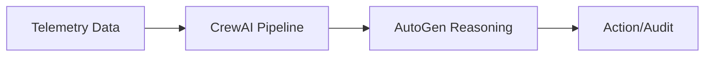

# digital-twin-analytics-agent

A system for monitoring robotic-assisted surgery using telemetry mining and digital twin agents.

## Architecture

This project uses a layered approach to process telemetry and plan corrective actions.



### Flow
1. **Telemetry**: Raw data from robot sensors.
2. **CrewAI**: Orchestrates phase detection, baseline comparison, risk assessment, and safety checks.
3. **AutoGen**: Handles deliberative reasoning for complex action planning.
4. **Audit**: Saves the final state and action plans for review.

---

## Quick Start

```bash
# Setup
python -m venv .venv
source .venv/bin/activate
pip install -r requirements.txt

# Run demo
python app.py
```

## Project Layout

- `app.py`: Entry point.
- `domain/`: Core logic and models.
- `crews/`: Telemetry processing agents.
- `autogen_layer/`: Decision making agents.
- `orchestrator/`: Workflow manager.
- `framework_stubs.py`: Mock frames for local execution.

---

## License
MIT
