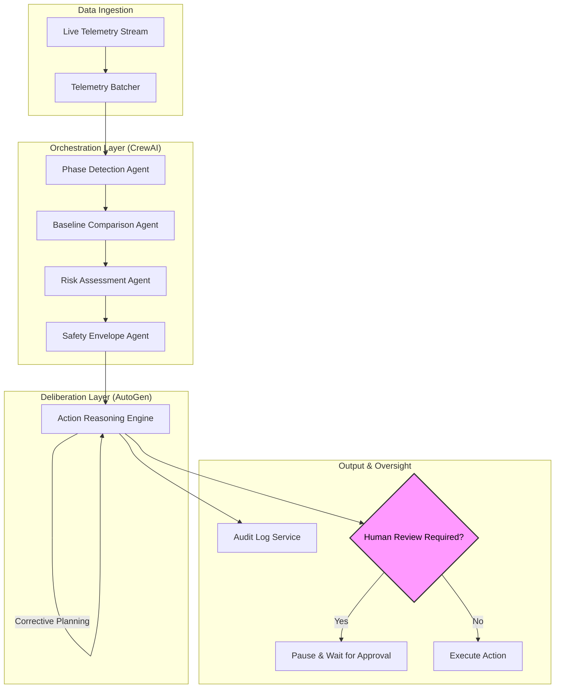

# 🦾 Digital Twin Analytics Agent

[](https://opensource.org/licenses/MIT)
[](https://www.python.org/downloads/)
[](https://crewai.com)
[](https://microsoft.github.io/autogen/)

> **A constrained, real-time monitoring and decision-support system for robotic-assisted surgery.**
> This system ingests live robot telemetry and compares it against validated reference trajectories (“Golden Runs”) and multi-dimensional safety envelopes.

---

## 🏛️ Architecture Overview

The system leverages a multi-layer agentic architecture to separate deterministic telemetry processing from complex, corrective action planning.



---

## ✨ Key Capabilities

### 🔍 Golden Run Comparison
The agent continuously mines telemetry to ensure alignment with a **Golden Run**—a validated, high-performance reference trajectory. Any deviation in torque, vibration, or latency triggers immediate re-evaluation.

### 🛡️ Safety Envelopes
The system monitors multi-dimensional constraints including:
- **Mechanical Stress Limits**: Preventing tool fatigue.
- **Joint Torque Thresholds**: Detecting unexpected resistance.
- **Vibration Signatures**: Identifying potential hardware failure or erratic tissue interaction.
- **Thermal & Latency Limits**: Ensuring operative environment stability.

### 🧠 Hybrid Agentic Strategy
- **CrewAI**: Used for the deterministic pipeline where tasks have a clear, linear dependency.
- **AutoGen**: Used for "deliberative logic"—where multiple agents (or a single reasoning engine) must simulate the outcomes of various corrective actions before committing to a plan.

---

## 🚀 Quick Start

### Prerequisites
- Python 3.9 or higher
- (Optional) OpenAI API Key for full LLM features

### Installation

```bash
# Clone the repository
git clone https://github.com/ShachiMistry/digital-twin-analytics-agent.git
cd digital-twin-analytics-agent

# Set up virtual environment
python -m venv .venv
source .venv/bin/activate  # On Windows: .venv\Scripts\activate

# Install dependencies
pip install -r requirements.txt
```

### Running the Demo
The project includes **framework stubs**, allowing you to run the end-to-end workflow immediately without waiting for CrewAI or AutoGen environment setups.

```bash
python app.py
```

---

## 📂 Project Structure

```text
digital_twin_ai_starter/
├── app.py                  # entry point & main workflow driver
├── config.py               # global system configurations
├── framework_stubs.py      # compatibility wrappers for CrewAI/AutoGen
├── domain/                 # Core logic & data models
│   ├── models.py           # Telemetry & Workflow state definitions
│   └── audit.py            # Audit log persistence service
├── crews/                  # CrewAI agents & task definitions
│   └── telemetry_crew.py   # Telemetry processing pipeline
├── autogen_layer/          # AutoGen deliberation logic
│   └── group_chat.py       # Reasoning engine & corrective planning
├── orchestrator/           # High-level workflow management
│   └── workflow.py         # The DigitalTwinWorkflow engine
└── tests/                  # Unit and integration tests
```

---

## 📜 License
This project is licensed under the MIT License - see the [LICENSE](LICENSE) file for details.

---

> [!TIP]
> **Switching to Real Frameworks:**
> The `framework_stubs.py` file acts as a shim. To transition to production-grade CrewAI or AutoGen, simply update the imports in the stubs to point to the real libraries. The core domain structure remains stable.
